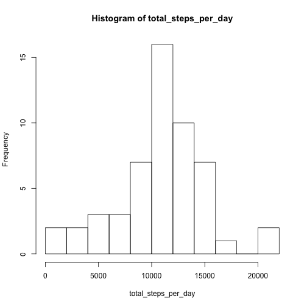
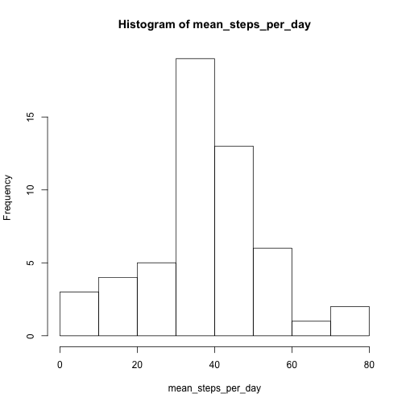
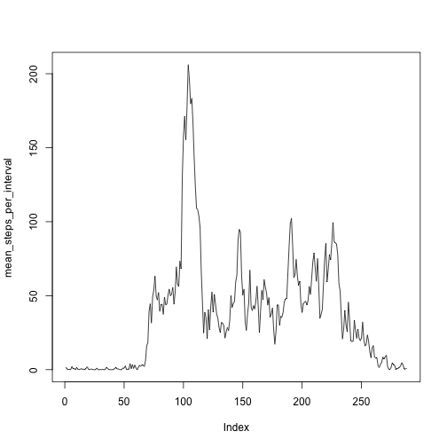
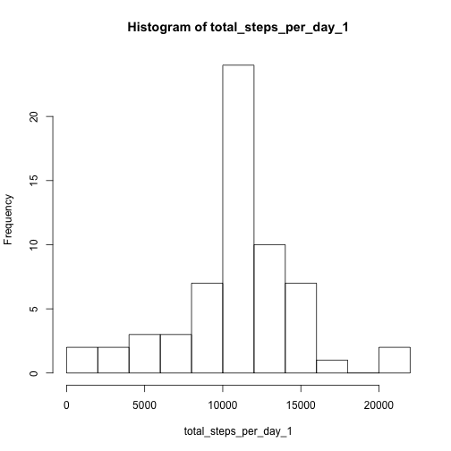
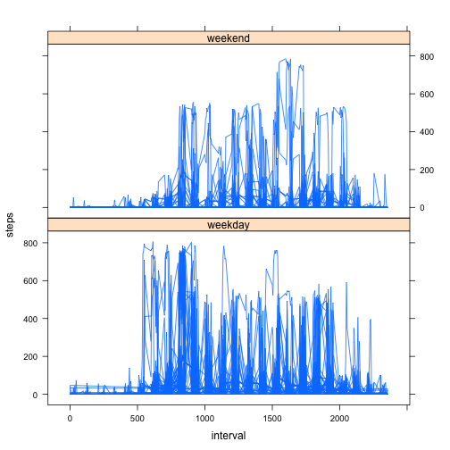

## Loading and preprocessing the data

```r
setwd("~/Desktop/github/RepData_PeerAssessment1")
activity<- read.csv("activity.csv")
head(activity)
```

```
##   steps       date interval
## 1    NA 2012-10-01        0
## 2    NA 2012-10-01        5
## 3    NA 2012-10-01       10
## 4    NA 2012-10-01       15
## 5    NA 2012-10-01       20
## 6    NA 2012-10-01       25
```

```r
str(activity)
```

```
## 'data.frame':	17568 obs. of  3 variables:
##  $ steps   : int  NA NA NA NA NA NA NA NA NA NA ...
##  $ date    : Factor w/ 61 levels "2012-10-01","2012-10-02",..: 1 1 1 1 1 1 1 1 1 1 ...
##  $ interval: int  0 5 10 15 20 25 30 35 40 45 ...
```

*After viewing the dataframe I don't think a reprocessing is needed at the moment.*  

___

## What is mean total number of steps taken per day?

```r
total_steps_per_day <- tapply(activity$steps, activity$date, sum)
hist(total_steps_per_day, breaks = 10)
```

 

```r
mean_steps_per_day<- tapply(activity$steps, activity$date, mean)
hist(mean_steps_per_day, breaks = 10)
```

 

```r
average_all_days<- mean(total_steps_per_day, na.rm = TRUE)
median_all_days<- median(total_steps_per_day, na.rm = TRUE)
average_all_days
```

```
## [1] 10766.19
```

```r
median_all_days
```

```
## [1] 10765
```

___

## What is the average daily activity pattern?

```r
mean_steps_per_interval<- tapply(activity$steps, activity$interval, mean, na.rm = TRUE)
str(mean_steps_per_interval)
```

```
##  num [1:288(1d)] 1.717 0.3396 0.1321 0.1509 0.0755 ...
##  - attr(*, "dimnames")=List of 1
##   ..$ : chr [1:288] "0" "5" "10" "15" ...
```

```r
plot(mean_steps_per_interval, type = "l")
```

 

```r
max(mean_steps_per_interval)
```

```
## [1] 206.1698
```

```r
my_obs<- which(mean_steps_per_interval== max(mean_steps_per_interval))
my_obs
```

```
## 835 
## 104
```

___

## Imputing missing values

*First let's see how many NAs are there.*


```r
sum(is.na(activity))
```

```
## [1] 2304
```

```r
sum(is.na(activity$steps))
```

```
## [1] 2304
```

*Ok, the same number in the dataframe and in steps vector.
Now we have to figure out a strategy to fill in with something meaningful. I think that replacing the NA with the mean value for that interval across the day could make sense.
We already have a vector of mean value for each interval, so we have to think how to use it to fill in the NA values. Let's check if this vector has Na values in it.*


```r
sum(is.na(mean_steps_per_interval))
```

```
## [1] 0
```

*ok, nothing there!
Now I created a logical index vector that could be of use in selecting what values to replace and what not*


```r
index<- is.na(activity$steps) 
long_mean_steps_per_interval<- rep(mean_steps_per_interval, 61)
library(dplyr)
activity<- tbl_df(activity)
activity_1<- mutate(activity, steps = replace(steps, index, long_mean_steps_per_interval))
str(activity_1)
```

```
## Classes 'tbl_df', 'tbl' and 'data.frame':	17568 obs. of  3 variables:
##  $ steps   : num  1.717 0.3396 0.1321 0.1509 0.0755 ...
##  $ date    : Factor w/ 61 levels "2012-10-01","2012-10-02",..: 1 1 1 1 1 1 1 1 1 1 ...
##  $ interval: int  0 5 10 15 20 25 30 35 40 45 ...
```

```r
sum(is.na(activity_1))
```

```
## [1] 0
```

```r
total_steps_per_day_1 <- tapply(activity_1$steps, activity_1$date, sum)
hist(total_steps_per_day_1, breaks = 10)
```

 

```r
average_daily_1<- mean(total_steps_per_day_1)
median_daily_1<- median(total_steps_per_day_1)
average_daily_1
```

```
## [1] 10766.19
```

```r
median_daily_1
```

```
## [1] 10766.19
```


___

## Are there differences in activity patterns between weekdays and weekends?

*first convert date in a Date Format*

```r
activity_2<- mutate(activity_1, date = as.Date(date, "%Y-%m-%d"))
str(activity_2)
```

```
## Classes 'tbl_df', 'tbl' and 'data.frame':	17568 obs. of  3 variables:
##  $ steps   : num  1.717 0.3396 0.1321 0.1509 0.0755 ...
##  $ date    : Date, format: "2012-10-01" "2012-10-01" ...
##  $ interval: int  0 5 10 15 20 25 30 35 40 45 ...
```

*then add a column with weekdays*

```r
activity_2<- mutate(activity_2, weekdays = weekdays(date))
```

*now create a column with two factors: weekend and weekday*
*first convert date in a Date Format*

```r
activity_2<- mutate(activity_1, date = as.Date(date, "%Y-%m-%d"))
str(activity_2)
```

```
## Classes 'tbl_df', 'tbl' and 'data.frame':	17568 obs. of  3 variables:
##  $ steps   : num  1.717 0.3396 0.1321 0.1509 0.0755 ...
##  $ date    : Date, format: "2012-10-01" "2012-10-01" ...
##  $ interval: int  0 5 10 15 20 25 30 35 40 45 ...
```

*then add a column with weekdays*

```r
activity_2<- mutate(activity_2, weekdays = weekdays(date))
```

*now we have to create a column with two factors: weekend and weekday and to take advantage of an index vector we have to use numbers for weekdays so I'm going to use lubridate*
  

```r
library(lubridate)
activity_2<- mutate(activity_2, weekdays = wday(date, label=FALSE))
index_wdays<- which(activity_2$weekdays>=2 & activity_2$weekdays<=6)
index_wend<- which(activity_2$weekdays==1 | activity_2$weekdays==7)
activity_2<- mutate(activity_2, weekdays = replace(activity_2$weekdays, index_wend, "weekend"))
activity_2<- mutate(activity_2, weekdays = replace(activity_2$weekdays, index_wdays, "weekday"))
activity_2$weekdays<- as.factor(activity_2$weekdays)
```

*finally let's have a lattice plot*


```r
library(lattice)
xyplot(steps~interval|weekdays, data=activity_2, type = "l", layout = c(1,2))
```

 

